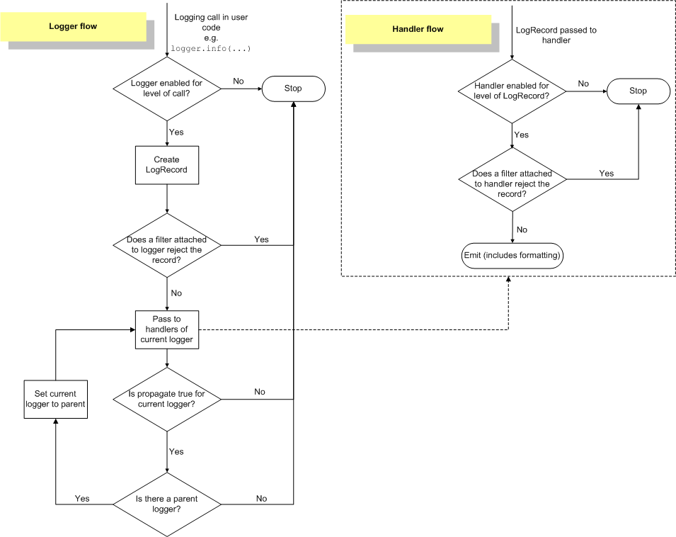

# 一、logging--Python的日志记录工具
```text
logging模块包括Logger、Handler、Formatter、Filter
Logger:提供日志接口，供应用代码使用。logger最长用的操作有两类：配置和发送日志消息。可以通过logging.getLogger(name)获取logger对象，如果不指定name则返回root对象，多次使用相同的name调用getLogger方法返回同一个logger对象。
Handler:日志处理器，对日志格式化并输出到指定位置
Formatter:日志格式
Filter:过滤器
一条日志生成经历了1.由logger 产生日志 -> 2.交给过滤器判断是否被过滤 -> 3.将日志消息分发给绑定的所有处理器 -> 4处理器按照绑定的格式化对象输出日志
```
> logging的流程

## 1、日志级别
>由高到底

级别|数值
---|---
CRITICAL|50
ERROR|40
WARNING|30
INFO|20
DEBUG|10
NOTSET|0
## 2、logging.Logger
* 2.1 常用且重要API

API|描述
---|---
setLevel()|设置日志级别
isEnabledFor()|
debug(msg)|debug级别的日志
info(msg)|info级别的日志
warning(msg)|warning级别的日志
error()|
critical()|
addFilter()|添加过滤器
removeFilter()|出去过滤器
addHandler()|添加输出方式
removeHandler()|移除输出方式

* 2.2 初始化
> 通过getLogger()进行初始化
```python
import logging
logger = logging.getLogger("myLogger")

```
> 通过配置文件初始化
```yaml
version: 1

disable_existing_loggers: False

formatters:
  simple:
    format: '%(message)s'
handlers:
  console:
    class: logging.StreamHandler
    level: INFO
    formatter: simple
  file_handler:
    class: logging.FileHandler
    level: DEBUG
    formatter: simple
    filename: test.log

loggers:
  console_logger:
    handlers: [console]
    level: INFO
  root:
    handlers: [console, file_handler]
    level: DEBUG
```
```python
import logging.config
import yaml

with open('./logging.yaml', 'r') as f:
    config = yaml.safe_load(f.read())

logging.config.dictConfig(config)
logger = logging.getLogger('console_logger')
logger.info('hello world')
```
> 通过字典初始化
```python
import logging.config
import logging

standard_format = '%(asctime)s %(threadName)s %(lineno)s %(message)s'
simplie_format = '%(levelname)s %(message)s'

LOGGING_DIC = {
    # 版本号
    'version': 1,
    # 是否使用此处定义的处理器
    'disable_existing_loggers': False,
    # 定义日志格式
    'formatters': {
        "standard": {
            "format": standard_format,
        },
        "simple": {
            "format": simplie_format
        }
    },
    # 定义过滤器
    'filters': {},
    # 定义处理器
    'handlers': {
        'handler_fileHandler': {
            'filename': 'test.log',
            'class': "logging.FileHandler",
            'formatter': 'simple',
        },
        'handler_consoleHandler': {
            'class': 'logging.StreamHandler',
            'formatter': 'standard',
        }
    },
    # 定义logger
    'loggers': {
        'root': {
            'handlers': ['handler_consoleHandler', 'handler_fileHandler'],
            'level': 'INFO'
        },
        "simple": {
            'handlers': ['handler_consoleHandler'],
            'level': 'DEBUG'
        }
    }
}
logging.config.dictConfig(LOGGING_DIC)
logger = logging.getLogger('simple')
logger.info('hello world')
```
> 通过basicConfig配置日志
```python
import logging

logging.basicConfig(
    format='%(asctime)s %(lineno)d %(message)s',
    level=logging.INFO,
)
logger = logging.getLogger(__name__)
logger.info("hello world")
```
格式|描述
---|---
filename|指定使用指定的文件名而不是 StreamHandler 创建 FileHandler。
filemode|如果指定 filename，则以此模式打开文件(‘r’、‘w’、‘a’)。默认为“a”。
format|为处理程序使用指定的格式字符串。
datefmt|使用 time.strftime() 所接受的指定日期/时间格式。
style|如果指定了格式，则对格式字符串使用此样式。’%’ 用于 printf 样式、’{’ 用于 str.format()、’$’ 用于 string。默认为“%”。
level|将根记录器级别设置为指定的级别。默认生成的 root logger 的 level 是 logging.WARNING，低于该级别的就不输出了。级别排序：CRITICAL > ERROR > WARNING > INFO > DEBUG。（如果需要显示所有级别的内容，可将 level=logging.NOTSET）
stream|使用指定的流初始化 StreamHandler。注意，此参数与 filename 不兼容——如果两者都存在，则会抛出 ValueError。
handlers|如果指定，这应该是已经创建的处理程序的迭代，以便添加到根日志程序中。任何没有格式化程序集的处理程序都将被分配给在此函数中创建的默认格式化程序。注意，此参数与 filename 或 stream 不兼容——如果两者都存在，则会抛出 ValueError。
## 3、Handler
* 3.1、处理器的种类

种类|作用
---|---
StreamHandler：logging.StreamHandler()|日志输出到控制台
FileHandler:logging.FileHandler()|向一个文件输出日志
BaseRotatingHandler：logging.handlers.BaseRotatingHandler|基本的日志回滚方式
RotatingHandler：logging.handlers.RotatingHandler|日志回滚方式，支持日志文件最大数量和日志文件回滚
TimeRotatingHandler：logging.handlers.TimeRotatingHandler|日志回滚方式，在一定时间区域内回滚日志文件
SocketHandler：logging.handlers.SocketHandler|远程输出日志到TCP/IP sockets
DatagramHandler：logging.handlers.DatagramHandler|远程输出日志到UDP sockets
SMTPHandler：logging.handlers.SMTPHandler|远程输出日志到邮件地址
SysLogHandler：logging.handlers.SysLogHandler|日志输出到syslog
NTEventLogHandler：logging.handlers.NTEventLogHandler|远程输出日志到Windows NT/2000/XP的事件日志
MemoryHandler：logging.handlers.MemoryHandler|日志输出到内存中的指定buffer
HTTPHandler：logging.handlers.HTTPHandler|通过"GET"或者"POST"远程输出到HTTP服务器
WatchedFileHandler： logging.handlers.WatchedFileHandler|用于监视文件的状态，如果文件被改变了，那么就关闭当前流，重新打开文件，创建一个新的流
> StreamHandler、fileHandler控制器---常用
```python
import logging

# 初始化logger
logger = logging.getLogger("myLogger")

# 初始化处理器,输出日志到文件中
fh = logging.FileHandler('./test.log')
# 初始化处理器，输出日志到控制台
ch = logging.StreamHandler()

# 初始化输出格式
formatter = logging.Formatter(
    """
    %(name)s
    %(lineno)d
    %(message)s
    """
)
# 处理器添加输出格式
fh.setFormatter(formatter)
ch.setFormatter(formatter)

# logger添加处理器
logger.addHandler(fh)
logger.addHandler(ch)

# 输出日志
logger.info("hello world")
```
> STMPHandler
```python

```
## 4、Formatter日志格式
> 使用的格式化串

格式化|描述
---|---
%(name)s|Logger的名字
%(levelno)s|数字形式的日志级别
%(levelname)s|文本形式的日志级别
%(pathname)s|调用日志输出函数的模块的完整路径名，可能没有
%(filename)s|调用日志输出函数的模块的文件名
%(module)s|调用日志输出函数的模块名
%(funcName)s|调用日志输出函数的函数名
%(lineno)d|调用日志输出函数的语句所在的代码行
%(created)f|当前时间，用UNIX标准的表示时间的浮 点数表示
%(relativeCreated)d|输出日志信息时的，自Logger创建以 来的毫秒数
%(asctime)s|字符串形式的当前时间。默认格式是 “2003-07-08 16:49:45,896”。逗号后面的是毫秒
%(thread)d|线程ID。可能没有
%(threadName)s|线程名。可能没有
%(process)d|进程ID。可能没有
%(message)s|用户输出的消息

```python
import logging

logger = logging.getLogger("myLogger")
logger.setLevel(logging.DEBUG)
handler = logging.StreamHandler()
formatter = logging.Formatter(
    """
    %(name)s
    %(levelno)s
    %(levelname)s
    %(pathname)s
    %(filename)s
    %(module)s
    %(funcName)s
    %(lineno)d
    %(created)f
    %(asctime)s
    %(thread)s
    %(threadName)s
    %(process)s
    %(message)s
    """
)
handler.setFormatter(formatter)
handler.setLevel(logging.DEBUG)
logger.addHandler(handler)

def debug():

    logger.debug("你好")

if __name__ == '__main__':
    debug()
```
## 5、Filter过滤器
> 初始化方法
```text
filter = logging.Filter(name='')
```
```python
import logging

logger_one = logging.getLogger('one')
logger_one.setLevel(logging.INFO)
logger_two = logging.getLogger('one.two')
logger_two.setLevel(logging.INFO)


formatter_one = logging.Formatter('%(message)s')
handler = logging.StreamHandler()
handler.setFormatter(formatter_one)
fil = logging.Filter(name='one.two')
handler.addFilter(fil)

logger_one.addHandler(handler)
logger_two.addFilter(handler)

logger_one.info('你好')
logger_two.info('hello world')
```
> 输出结果为
```text
hello world
```

